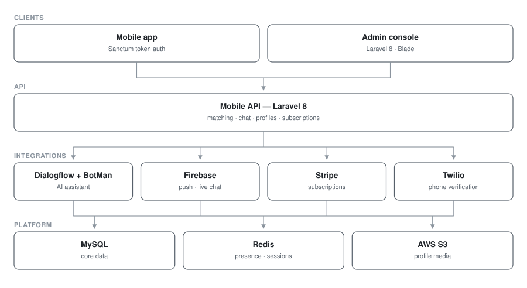

# 2Again — Dating App Platform

**Dating app · Laravel 8 · AI assistant**

A mobile dating platform with matching, real-time chat, an AI onboarding assistant, subscriptions and moderation tooling.

> **Source code is private.** This repository documents the architecture and engineering work.

## My role
Backend engineer

## Architecture

| Service | Stack | Responsibility |
|---|---|---|
| Mobile API | Laravel 8, Sanctum | Matching, chat, profiles, subscriptions |
| Admin console | Laravel 8, Blade | Moderation, analytics, user management |

### Service topology

## Engineering highlights

**Conversational AI.** BotMan paired with Google Cloud Dialogflow powers an in-app assistant with intent detection — onboarding guidance and icebreaker suggestions handled without human support.

**Real-time messaging and push.** Firebase (`kreait/laravel-firebase`) for push notifications and live chat delivery to mobile clients, with Redis (`predis`) backing presence and session state.

**Social sign-in.** Laravel Socialite with a Facebook provider for one-tap onboarding, alongside Sanctum token auth for the mobile client.

**Payments.** Stripe for subscription tiers and in-app purchases.

**Verification.** Twilio SMS for phone verification and transactional alerts — critical for trust and abuse prevention on a dating product.

**Media at scale.** AWS S3 via Flysystem for profile photo storage and delivery.

**Cross-language reach.** `stichoza/google-translate-php` for automatic message and profile translation between users of different locales.

**Moderation tooling.** Excel export (`maatwebsite/excel`) and Yajra DataTables server-side processing for reviewing large user and report tables.

## Stack

`Laravel 8` · `PHP` · `MySQL` · `Redis` · `Firebase` · `Dialogflow` · `BotMan` · `Stripe` · `Twilio` · `AWS S3` · `Sanctum`
